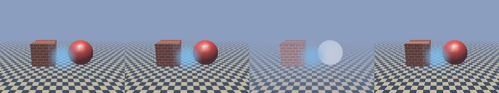

# minigl.library 29 for AmigaOS 3

OpenRTG's MiniGL is OpenGL 1.1's fixed-function pipeline for 68k programs. It uses the interface of the 2026 minigl.library 29, so programs built for that library run on this one unchanged.

The library does the front end itself:

- transform, lighting, fog and texture coordinates;
- clipping, culling, points, lines and polygons;
- textures and display lists.

It sends triangles to the one library's 3D ops (`include/opengpu/stream3d.h`: TRIANGLES, RENDER3D, TEXENV, TEXTURE, DEPTH, CLEAR3D). These are the same ops Warp3D.library and SDL 2 use, and the same rasteriser draws them. It does not go through Mesa.

*MGLTest's first frame, 320x240, on a scratch copy of the Showcase instance (OS 3.2.3, AC090 68040), 8 October 2026. The same program is used for all four pictures.*

- **First:** this library on the 68k.
- **Second:** this library on OpenGPU. It is byte for byte the same picture.
- **Third:** the classic minigl.library 29.1 on OpenRTG's Warp3D.library.
  - Its lighting calls are stubs, so the sphere is unlit.
  - Its fog goes through Warp3D's fog, which is linear in 1/z, so the scene is foggier.
- **Fourth:** Mesa 26.2.4's softpipe on the 68k.
  - Against the first picture: a mean difference of 3 out of 255.
  - 11% of pixels differ by more than 8, nearly all on texture edges.

## Drivers

| Route | `ENV:MiniGL/Driver` | Where it draws |
| --- | --- | --- |
| OpenGPU | `OpenGPU` | Batches go to `opengpu.library`, whose back end draws them. On AmigaChrome that is `ACRTG.gpu` on the Cradle. |
| 68k | `CPU` | The 3D core (`library/opengpu/ogpu_3d.c`) is linked into the library. It needs no `opengpu.library`. |

`Auto` (the default) takes OpenGPU when its back end is not the 68k itself, and the 68k route otherwise.

A frame is one batch unless it outgrows one. `mglSwitchDisplay` runs the batch and shows the frame.

## Programs

- **Through the table.** A program includes `<proto/minigl.h>`, links `libminigl.a`, and calls `MiniGLOpen()` and `MiniGLClose()`.
  - The library's one function, at -30, answers the dispatch table. That is ABI 5, 205 entries, 840 bytes.
  - Every `gl*`, `glu*`, `glut*` and `mgl*` call is an inline through that table.
  - Programs built with the minigl.library 29 SDK run unchanged. The classic package's gears, cube, ring and warp demos were run on this library.
- **Through functions.** A program written for the linked-in MiniGL includes `<mgl/gl.h>`, calls `MGLInit()` and `MGLTerm()`, and links `libmgl.a`. That library has every call as a function that goes through the same table.

`minigl_api.txt` lists the table and the calls. `gen_api.py` (`build.sh api`) makes these files from it:

- `include/libraries/minigl_dispatch.h`
- `include/mgl/minigl_calls.h`
- `mgl_slots.h`
- `mgl_table.c`
- `mgl_static.c`

## What is in it

- **Primitives.** Points, lines, line strips and loops, triangles, strips, fans, quads, quad strips and polygons.
  - Polygon modes: fill, line and point.
  - Face culling, edge flags, `mglMinTriArea`.
- **Vertex arrays.**
  - `glDrawArrays`, `glDrawElements` (8-, 16- and 32-bit indices), `glArrayElement`, `glMultiDrawArrays`.
  - `glInterleavedArrays` in all 14 formats.
  - Locked arrays.
  - MiniGL's ARGB and BGRA colour arrays.
- **Transform.**
  - The three matrix stacks: 32 modelview, 8 projection, 8 texture per unit.
  - `glRotatefEXT` and `glRotatefEXTs`, `gluPerspective`, `gluLookAt`.
  - `glViewport`, `glDepthRange`.
- **Lighting.**
  - Eight lights: directional, positional with attenuation, and spot.
  - Materials, colour material, local viewer.
  - The specular power comes from a table made when the shininess changes.
- **Fog.** Linear, exponential and exponential squared, worked out per vertex from the eye distance.
- **Texture coordinates.**
  - Generated: object linear, eye linear and sphere map.
  - The texture matrix.
  - Perspective-correct division by q.
- **Textures.**
  - Formats: RGB, RGBA, BGR, BGRA, luminance, luminance and alpha, alpha, intensity, and the packed 5-6-5, 4-4-4-4, 5-5-5-1, 3-3-2 and 8-8-8-8 types.
  - Paletted textures with a shared or own palette (`GL_EXT_paletted_texture`, `GL_EXT_shared_texture_palette`).
  - Mipmaps, the six filters, repeat and clamp.
  - `glTexSubImage2D`, `glCopyTexImage2D`, `glCopyTexSubImage2D`, `gluBuild2DMipmaps`.
- **Two texture units** (`GL_ARB_multitexture`). The second unit is drawn as a second pass over the same triangles, blended by its environment.
- **Fragments.**
  - Z (16 or 32 bits, eight functions, write mask), the alpha test, the fifteen blend factors, the colour mask and the scissor.
  - Polygon offset and `mglSetZOffset`.
- **Display lists.** They record what OpenGL lets them hold, nested up to 64 deep.
- **GLU.** Quadrics (sphere, cylinder, disk) in every draw style, with normals and texture coordinates. Also `gluBuild2DMipmaps` (any size) and `gluErrorString`.
- **GLUT.** The window, display, idle, keyboard and reshape functions, the main loop, `glutGet`, game mode, and the solid cube, sphere, cone, torus and dodecahedron.
- **The display.**
  - A screen of its own, a Workbench window, a window or a bitmap the program owns.
  - `mglLockBack`, `mglResizeContext`, `mglGetSupportedScreenModes`, `mglWriteShotPPM`.
  - The main loop with key, special-key, mouse and idle functions.
  - R5G6B5 and A8R8G8B8 are drawn in place; other formats through an ARGB32 copy.
  - A screen's frame is drawn off screen and copied on in one blit. On RTG that is quicker than changing screen buffers. `ENV:MiniGL/Flip 1` asks for buffer changes instead.

Not offered, as MiniGL never had them:

- the stencil, accumulation and colour-index buffers;
- clip planes, evaluators and feedback;
- two-sided lighting (the front material lights both faces);
- `glBlendEquation` other than adding (the others are drawn as adding).

## Measured

All runs were on a scratch copy of Instance-11 (OS 3.2.3, AC090 68040, OpenRTG) on 8 October 2026. The OpenGPU route ran on a lab runtime and `ACRTG.gpu` built with the 3D core: the PC's CPU, not yet its GPU.

These MGLTest rows come from one boot, on a busy host. W3DTest on the 68k, run in the same boot, gave 31.9 frames a second; on a quiet host it gives 42.7.

| MGLTest, 320x240 (frames a second) | |
| --- | --- |
| This library, OpenGPU | 99.0 |
| This library, 68k | 29.9 |
| Classic minigl.library 29.1 on Warp3D.library, OpenGPU | 12.3 |
| Classic minigl.library 29.1 on Warp3D.library, 68k | 7.0 |
| Mesa softpipe, 68k | 1.06 |

Other GL programs through this library, 320x240:

| Program | 68k | OpenGPU |
| --- | --- | --- |
| Mesa's Open demos: boing (GL 1.x) | 17.1 | 36.9 |
| Mesa's Open demos: chrome gears (display lists, sphere map) | 27.3 | 75.4 |
| MGLGlutTest (GLUT, in a Workbench window) | | 121 |

Correctness:

- `tests/run_minigl.sh` builds the library's own files 32-bit on the PC, under AddressSanitizer and UBSan, with the calls going through the table. It checks OpenGL's behaviour piece by piece and the golden scene (`tests/golden/minigl-scene.txt`).
- Built for the 68k, the library has no FPU instruction the 68040 leaves to software. `build.sh` checks for them. It also has no branch of the shape GCC 6.5 gets wrong (`tests/scan_68k_branches.py`).

## Licence and sources

The library, its headers, its tests and its tools are MIT, Copyright (c) 2026 Dalsin Limited. What the Team checked:

- **Hyperion's MiniGL 1.2.** It is under the Hyperion MiniGL Open Source License, which is limited to AmigaOS and asks for changes to be published. That does not fit an MIT repository, so it was a reference for behaviour only. No code was taken.
- **The 2026 68k minigl.library** (29.1, its SDK and its source repository). The repository has no licence file, and the library is derived from MiniGL 1.2. It was a reference for the interface only.
  - The table's order, its types and the token values are interface facts that compiled programs depend on.
  - The Team's headers were compiled side by side with the SDK's. All 430 token values, all 205 entry offsets, the table's size (840 bytes) and the types' sizes are the same.
  - No SDK file is in this repository.
- **OpenGL 1.1's numbers** come from the OpenGL specification. GLUT's come from GLUT's documented values.
- Programs used for testing were run from local copies and are not in this repository:
  - the classic package's demos;
  - the classic library;
  - Mesa for the comparison: the Team's own wt-mesa build, a lab-only runner.

## Files

- `minigl_api.txt`: the interface. `gen_api.py` makes the generated files from it.
- `mgl_internal.h`: the context and the parts.
- `mgl_lib.c`: the library and preferences.
- `mgl_math.c`: sines, exponentials and powers without the 68040's missing instructions.
- `mgl_state.c`: state, lights, queries.
- `mgl_matrix.c`: matrices.
- `mgl_vertex.c`: `glBegin`/`glEnd`, arrays and primitives.
- `mgl_pipe.c`: transform, lighting, clipping, to the stream.
- `mgl_texture.c`: textures.
- `mgl_out.c`: the batch.
- `mgl_list.c`: display lists.
- `mgl_glu.c`: GLU.
- `mgl_glut.c`: GLUT.
- `mgl_display.c`: screens, windows, input.
- `client/`: `libminigl.a`.
- `mgl_static.c`: `libmgl.a`.
- Tools:
  - `tools/mgltest.c` and `tools/mgltest_scene.c` (MGLTest; MGLTestStatic is the same program through `libmgl.a`);
  - `tools/mglgluttest.c` (MGLGlutTest).
- Build: `library/minigl/build.sh [OUT]`, which `library/build.sh` also runs.

## Left to do

- **The PC's GPU.** The real runtime and `ACRTG.gpu` must carry the 3D ops (the library's owner); then a Vulkan path for them.
- **Faster 68k front end.** Cache transformed positions for locked arrays (Quake's way of drawing), and specialise the paths without lighting.
- **Two-sided lighting.**
- **Games.** Try GLQuake (`MiniGL_Library_Quake1`), which needs the Quake shareware data: a download.
