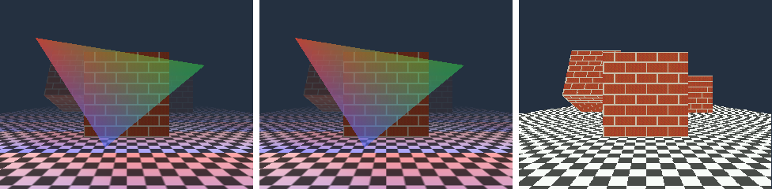

# Warp3D.library 5.0 for AmigaOS 3

OpenRTG's Warp3D: the classic Amiga 3D API that 68k games, MiniGL and StormMesa call.

It is a thin front end over the one library's 3D path. It keeps Warp3D's state, converts vertices and textures, and turns every call into OGPU stream v1.2 commands (`include/opengpu/stream3d.h`). One rasteriser draws them.

*W3DTest, 320x240, on a scratch copy of the Showcase instance (OS 3.2.3, AC090 68040).*

- **Left:** W3D_CPU.
- **Middle:** W3D_OpenGPU. It is byte for byte the same picture as W3D_CPU.
- **Right:** Wazp3D 56 with its default settings, which leave out fog, the lighting of textures and the see-through pane.

## Drivers

| Driver | `W3D_CC_DRIVERTYPE` | Where it draws |
| --- | --- | --- |
| W3D_OpenGPU | `W3D_DRIVER_3DHW` | It sends batches to `opengpu.library`, whose back end draws them. On AmigaChrome that is `ACRTG.gpu`, the Cradle on the PC; on a PiStorm it will be `PiStorm.gpu`. It is offered when `OGPU_Query(OGPU_OP_TRIANGLES)` answers. |
| W3D_CPU | `W3D_DRIVER_CPU` | The same 3D core (`library/opengpu/ogpu_3d.c`) linked in, on the 68k. It needs no `opengpu.library`, so it works on any Amiga with a 68040 or 68060, its FPU and RTG. |

`W3D_DRIVER_BEST` takes OpenGPU when its back end is not the 68k itself, and the CPU driver otherwise, unless the preferences say which.

Both drivers draw the same pixels, because both run the same core: W3DCheck and W3DTest compare them. W3D_AGA, the blitter as a simple 3D chip, is a later stage (`AGA.gpu`, OpenGPU's G5).

## What is in it

- **The function table.** All 92 entries of version 5's 68k table: the 84 of version 4, then SetTextureBlend, SecondaryColorPointer, FogCoordPointer, InterleavedArray, ClearBuffers, SetParameter, PinTexture and SetDrawRegionTexture.
  - With the five Tags forms, which are link-library stubs as on every Amiga library, that makes the 97 names version 5 has.
  - The order and the registers are what programs call; `warp3d_lib.sfd` lists them.
- **Drawing.**
  - Triangles, fans and strips, and their V forms.
  - Points and lines of any size, stippled lines and polygon stipple. Points and lines are drawn as quads.
  - Vertex arrays: DrawArray and DrawElements over every primitive, ubyte, uword and ulong indices, and interleaved arrays.
  - Face culling by SetFrontFace.
- **Textures.**
  - All eleven formats: CHUNKY with its palette, A1R5G5B5, R5G6B5, R8G8B8, A4R4G4B4, A8R8G8B8, A8, L8, L8A8, I8, R8G8B8A8.
  - They are kept as ARGB32 with what the texels mean, so REPLACE, DECAL, MODULATE and BLEND follow OpenGL's tables for alpha, luminance and intensity textures.
  - Mipmaps, made by the library or given by the program.
  - Nearest, bilinear and the four mip filters; repeat and clamp; perspective correction.
  - ADD, SUB and OFF (version 5); chroma test.
  - Drawing into a texture (SetDrawRegionTexture).
- **Fragments.**
  - Z: 16 or 32 bits, eight compare modes, update on or off. Reading and writing Z pixels and spans.
  - 8-bit stencil, with every function and operation, wrap included.
  - Alpha test.
  - All fifteen blend factors.
  - The sixteen logic ops.
  - The colour mask.
  - Fog: linear, exponential and exponential squared from w, interpolated fog, version 5's Z fog and fog coordinates.
  - Specular, added after texturing.
- **Drawing areas.**
  - Any CyberGraphX bitmap of 15 bits or more. R5G6B5 and A8R8G8B8 are drawn in place; the other formats through an ARGB32 copy.
  - W3D_Bitmaps in every W3D_FMT.
  - Double height, y offsets, scissors.
- **Not offered:**
  - antialiasing (as Wazp3D);
  - volume textures;
  - more than one texture unit: version 5's combiners, beyond stage 0's environment, answer W3D_UNSUPPORTED, and W3D_Q_NUM_TMU is 1.

## Preferences

`C:Warp3DPrefs` sets ENV:Warp3D/, which OpenPrefs' Acceleration page also writes:

- `Driver` is Auto, CPU or OpenGPU.
- `ZBuffer` is 16 or 32.
- `Fog`, `Perspective`, `Filtering` and `Lighting` can each be switched off for speed. These are Wazp3D's options of those names.

Each new context reads them.

`Warp3DPrefs FROMWAZP3D SAVE` carries Wazp3D's settings over from ENVARC:Wazp3D.cfg, or takes Wazp3D's defaults when there is none, and leaves Wazp3D's files where they are. The installer runs it when it finds Wazp3D.

No program found so far needs Wazp3D's `soft3d.library`, so there is no stand-in for it.

## Measured

All runs are on a scratch copy of Instance-11 (OS 3.2.3, AC090 68040, hyper pace, OpenRTG), 8 October 2026.

- W3D_OpenGPU ran on a lab runtime built with the 3D core and a lab `ACRTG.gpu` that answers for it. The ring runs the C core on the PC, not yet the PC's GPU.
- The OpenGPU core was openamigartg#27's.

| W3DTest (frames a second) | 320x240 | 640x480 |
| --- | --- | --- |
| W3D_CPU, everything on | 37.5 | 11.9 |
| W3D_OpenGPU, everything on | 211 | 62.5 |
| W3D_CPU, Wazp3D's settings (no fog, lighting or filtering) | 52.6 | |
| W3D_OpenGPU, Wazp3D's settings | 395 | |
| Wazp3D 56, its defaults | 13.0 | |

The 3D core alone on the 68k (Test3D rates), in nanoseconds a pixel:

| Work | ns a pixel |
| --- | --- |
| Flat | 60 |
| Gouraud | 138 |
| Texture, nearest | 156 |
| Texture, bilinear | 251 |
| Texture and Gouraud with Z | 208 |
| Bilinear, Z, fog and perspective | 390 |

Third-party program:
- Cow3D 6 (Alain Thellier's Warp3D test program, run from a local copy, not in this repository) draws correctly on both drivers.

Correctness:
- W3DCheck passes all 183 of its checks on both drivers.
- The core's tests pass on x86-64 and on the 68k (big-endian), with the same golden scene (`tests/golden/opengpu-3d.txt`).

## Licence and sources

The library, its headers and its tests are MIT, Copyright (c) 2026 Dalsin Limited. What the Team checked:

- **The Warp3D SDK.** Its headers and FD file say "All rights reserved; see the documentation for conditions". The developer package's terms let it be redistributed only whole, free of charge and with its notice. That does not fit an MIT repository, so none of it is here.
  - `include/Warp3D/Warp3D.h` is the Team's own, written from the published autodocs and programmer's guide.
  - Its numbers and structure layouts are interface facts that compiled programs depend on.
  - `tests/w3d_layout.c` checks all 185 sizes and offsets at compile time.
  - Against builds with the version 5 header, all 495 constants matched; all 168 offsets version 4 shares match too.
- **The version 5 additions.** Their names, numbers, LVO order and registers come from the AmigaOS 4 autodocs and the 68k trap table that OS 4 and MorphOS use for 68k programs.
- **Wazp3D (GPL) and AROS's Warp3D.** These were behaviour references only. No code was taken.
  - Wazp3D 56 from Aminet (driver/video/Wazp3D.lha) was run on the scratch instance for the picture and speed comparison. It is not in this repository.
- **MiniGL.** Classic MiniGL games link MiniGL into themselves and call Warp3D.library's table, so they need only this library.
  - MiniGL 1.2 is under Hyperion's MiniGL Open Source License.
  - The 2026 68k minigl.library repository has no licence file, so it is not shipped here.
  - OpenRTG's own minigl.library comes next.

## Files

- `warp3d_lib.sfd`: the function table. `build.sh headers` remakes `include/inline/Warp3D.h`, `include/proto/Warp3D.h` and `include/clib/Warp3D_protos.h` from it.
- `w3d_lib.c`: the library, its table and preferences.
- `w3d_ctx.c`: contexts, state, the Z and stencil buffers.
- `w3d_batch.c`: drawing areas, batches, sending them.
- `w3d_draw.c`: drawing calls and vertex arrays.
- `w3d_texture.c`: textures.
- `w3d_query.c`: queries, drivers, screen modes.
- Tools:
  - `tools/w3dtest.c` (W3DTest);
  - `tools/w3dcheck.c` (W3DCheck);
  - `tools/w3dprefs.c` (Warp3DPrefs).
- Build: `library/warp3d/build.sh [OUT]`, which `library/build.sh` also runs.

## Left to do

- **W3D_OpenGPU on the PC's GPU.** The real runtime and `ACRTG.gpu` must carry the 3D ops, which the library's owner is doing; then a Vulkan path for them.
- **W3D_AGA.** The blitter as a simple 3D chip (G5).
- **More texture units** (version 5 combiners).
- **CLUT8 drawing areas.** The core can do them through a pen table; the library does not offer them yet.
- **Faster 68k spans** for the remaining modes.
